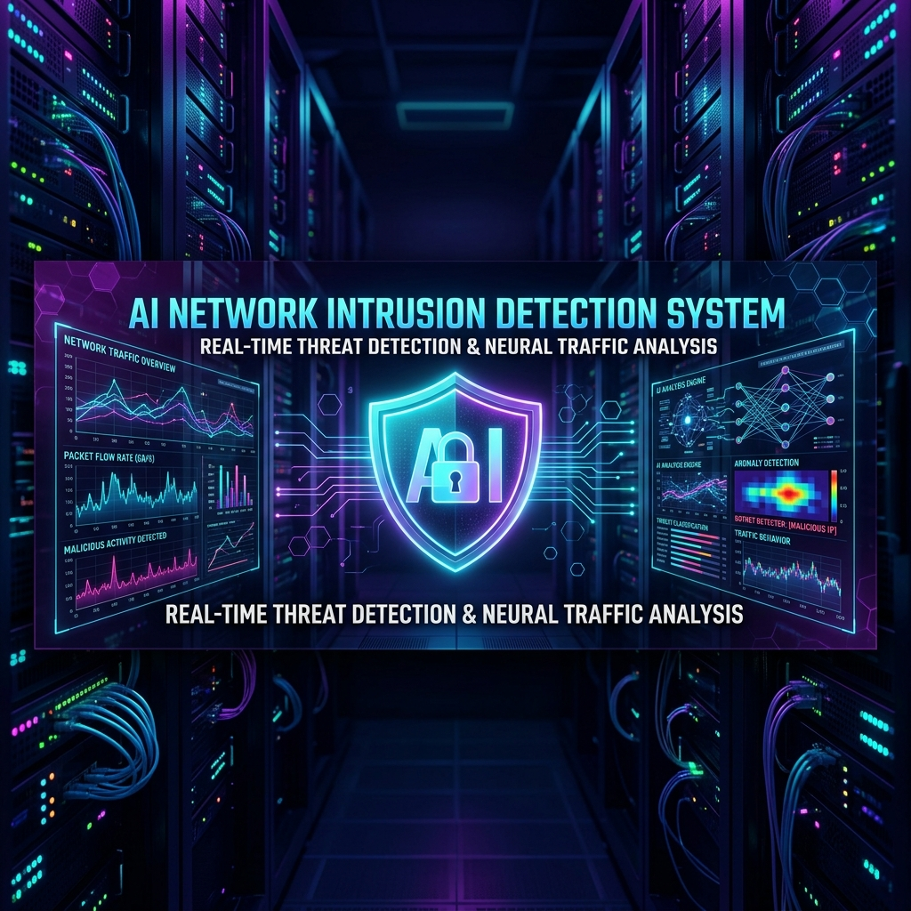

<!-- BANNER -->

  

<!-- DYNAMIC TYPING SUBTITLE -->

  

<!-- SNAKE CONTRIBUTION GRAPH -->

  <picture>
    <source media="(prefers-color-scheme: dark)" srcset="https://raw.githubusercontent.com/chimataraghuram/chimataraghuram/output/github-contribution-grid-snake-dark.svg">
    <source media="(prefers-color-scheme: light)" srcset="https://raw.githubusercontent.com/chimataraghuram/chimataraghuram/output/github-contribution-grid-snake.svg">
    
  </picture>

<!-- BADGES -->

  
  <!-- START_SECTION:followers -->
  
  <!-- END_SECTION:followers -->
  <!-- START_SECTION:stars -->
  
  <!-- END_SECTION:stars -->
  <!-- START_SECTION:deployments -->
  
  <!-- END_SECTION:deployments -->
  <!-- START_SECTION:repositories -->
  
  <!-- END_SECTION:repositories -->

<!-- OPEN TO WORK / HIRE ME -->

  
    
  

<!-- ACHIEVEMENTS -->

   
  <a href="https://github.com/chimataraghuram?tab=achievements">
<!--START_SECTION:achievements-->
    
    
    
<!--END_SECTION:achievements-->
  </a>
   
  <strong>Official GitHub Achievements</strong>

## ⚡ About Me

<table>
  <tr>
    <td width="30%">
      
    </td>
    <td width="70%">
      <h2>Hello! I'm <b>Chimata Raghuram</b> 👋</h2>
      

        A B.Tech student with a diploma background in AI & ML, focused on developing Python full stack with AI powered and automated application
      

      <ul style="font-size: 1.1em; line-height: 1.8;">
        <li>🚀 Python Full-Stack Developer | Actively Learning & Tech Enthusiast</li>
        <li>🌍 Based in <b>Vijayawada, Andhra Pradesh, India</b></li>
        <li>🔭 Currently building: <a href="https://github.com/chimataraghuram/PORTFOLIO">PORTFOLIO</a> · <a href="https://github.com/chimataraghuram/PROJECT-FINDER">PROJECT-FINDER</a> · <a href="https://github.com/chimataraghuram/TECHBOY-AI">TECHBOY-AI</a></li>
        <li>📫 Reach me: <a href="https://www.linkedin.com/in/chimataraghuram/">LinkedIn</a> · <a href="https://linktr.ee/chimataraghuram">Linktree</a> · <a href="mailto:chimataraghuram02a@gmail.com">Email</a></li>
        <li>⚡ Fun fact: I built a <b>Space Invaders minigame</b> hidden inside my own portfolio — find it if you can! 🎮</li>
      </ul>
    </td>
  </tr>
</table>

 

  

## 💼 Work Experience

<table>
<tr>
<td width="50%" valign="top">

### 🐍 [Python Full Stack Intern](https://www.linkedin.com/in/chimataraghuram/)
**Nipuna Technology** | *11/2023 – 05/2024*
- Developed a web application by implementing **frontend interfaces** and backend logic using Python-based technologies.
- Gained hands-on experience in **API integration**, application structure, and full-stack development fundamentals.
 📍 *Vijayawada, Andhra Pradesh*

</td>
<td width="50%" valign="top">

### ☁️ [Cloud Computing Intern](https://www.linkedin.com/in/chimataraghuram/)
**APSSDC** | *05/2025 – 07/2025*
- Deployed web applications on **cloud platforms** and configured hosting environments.
- Gained hands-on experience in cloud fundamentals including **deployment workflows**, scalability basics, and resource management.
 📍 *Remote*

</td>
</tr>
<tr>
<td colspan="2" valign="top">

### 🤖 [Generative AI Intern](https://www.linkedin.com/in/chimataraghuram/)
**SmartBridge**
- Worked with **Generative AI models** and explored **Large Language Model (LLM)** applications and workflows.
- Built and tested **AI-driven workflows**, gaining hands-on experience in prompt engineering and automation concepts.

</td>
</tr>
</table>

 

  

## 🚀 TOP PROJECTS 📌

<table width="100%">
  <tr>
    <td width="40%" valign="middle" align="center">
      
        
      
    </td>
    <td width="60%" valign="top">
      <h3>🌐 <a href="https://github.com/chimataraghuram/PORTFOLIO">PORTFOLIO</a> &nbsp; </h3>
      
<strong>Official Developer Portfolio with Hidden Mini-Game</strong>

      
      

        
        
        
        
        
      

      
      <strong>Key Highlights:</strong>
      <ul>
        <li>Custom <strong>Space Invaders-style minigame</strong> hidden as an Easter egg inside the portfolio.</li>
        <li>Sleek <strong>glassmorphism UI</strong> with 60FPS parallax scrolling and animated particle effects.</li>
        <li>Synthetic retro-game audio engine built with the <strong>Web Audio API</strong> — no external libraries.</li>
        <li>Automated portfolio screenshots using <strong>Puppeteer</strong> for always up-to-date previews.</li>
        <li>Fully <strong>responsive design</strong> across all devices and screen sizes.</li>
        <li>Blazing-fast performance powered by <strong>TypeScript + React 18 + Vite</strong>.</li>
      </ul>
    </td>
  </tr>
</table>

<table width="100%">
  <tr>
    <td width="40%" valign="middle" align="center">
      
        
      
    </td>
    <td width="60%" valign="top">
      <h3>🔎 <a href="https://github.com/chimataraghuram/PROJECT-FINDER">PROJECT-FINDER</a> &nbsp; </h3>
      
<strong>The Ultimate Research & Discovery Engine 🚀</strong>

      
      

        
        
        
        
        
        
      

      
      <strong>Key Highlights:</strong>
      <ul>
        <li>High-density research engine to discover open-source projects, AI models, and technical datasets.</li>
        <li>Unified discovery across <strong>GitHub, Hugging Face, Kaggle, and LinkedIn</strong> with platform-native profiles.</li>
        <li>Integrated with <strong>TECHBOY AI</strong> for architectural reviews and pro-grade technical analysis.</li>
        <li><strong>Comparison Studio</strong> for side-by-side repository evaluation with detailed metrics.</li>
        <li>Secure <strong>cloud sync</strong> to save, tag, and revisit research sessions anytime.</li>
        <li>Advanced filtering by stars, language, license, and last activity date.</li>
      </ul>
    </td>
  </tr>
</table>

<table width="100%">
  <tr>
    <td width="40%" valign="middle" align="center">
      
        
      
    </td>
    <td width="60%" valign="top">
      <h3>🛒 <a href="https://github.com/chimataraghuram/TECHBOY-STORE">TECHBOY-STORE</a> &nbsp; </h3>
      
<strong>Modern E-Commerce Application</strong>

      
      

        
        
        
        
      

      
      <strong>Key Highlights:</strong>
      <ul>
        <li><strong>Modern e-commerce web application</strong> with a clean, responsive UI built in React.</li>
        <li>Product catalog with <strong>category filters</strong> and real-time search functionality.</li>
        <li>Full <strong>cart management</strong> — add, remove, and update item quantities seamlessly.</li>
        <li>Smooth animated <strong>page transitions</strong> and micro-interactions for a premium feel.</li>
        <li>Mobile-first <strong>responsive design</strong> that works across all screen sizes.</li>
        <li>Fast load performance powered by <strong>Vite</strong> with optimized bundle output.</li>
      </ul>
    </td>
  </tr>
</table>

<table width="100%">
  <tr>
    <td width="40%" valign="middle" align="center">
      
        
      
    </td>
    <td width="60%" valign="top">
      <h3>☁️ <a href="https://github.com/chimataraghuram/Virtual-Windows-Desktop-on-AWS-Using-Windows-Server">Virtual Windows Desktop</a> &nbsp; </h3>
      
<strong>AWS Cloud Infrastructure & Remote Desktop</strong>

      
      

        
        
        
        
      

      
      <strong>Key Highlights:</strong>
      <ul>
        <li>Deployed a fully functional <strong>Windows Server</strong> on AWS EC2 as a virtual desktop environment.</li>
        <li>Configured <strong>RDP (Remote Desktop Protocol)</strong> for secure remote access from any device.</li>
        <li>Set up <strong>Security Groups</strong> and inbound rules for fine-grained port access control.</li>
        <li>Optimized instance performance for smooth cloud computing workloads.</li>
        <li>Part of a broader <strong>AWS deployment suite</strong> including Ubuntu Server infrastructure.</li>
        <li>Documented end-to-end setup for reproducible cloud desktop environments.</li>
      </ul>
    </td>
  </tr>
</table>

 

  

## 📂 Other Projects

<table width="100%">
  <tr>
    <td width="40%" valign="middle" align="center">
      
        
      
    </td>
    <td width="60%" valign="top">
      <h3>🤖 <a href="https://github.com/chimataraghuram/TECHBOY-AI">TECHBOY-AI</a> &nbsp; </h3>
      
<strong>Premium AI Portfolio Assistant</strong>

      
      

        
        
        
        
      

      
      <strong>Key Highlights:</strong>
      <ul>
        <li><strong>Premium AI portfolio assistant</strong> with a custom Sunset Glassmorphism visual design.</li>
        <li>Powered by <strong>Google Gemini 2.0 Flash API</strong> with real-time token streaming for instant replies.</li>
        <li>Layered <strong>backdrop blurs</strong> and fluid jelly interaction animations for a premium feel.</li>
        <li><strong>Dynamic radial ambient lighting</strong> that reacts to user interactions.</li>
        <li>Deep portfolio knowledge base — answers questions about all projects, skills, and experience.</li>
        <li>Zero-latency streaming responses with a smooth, chat-native user experience.</li>
      </ul>
    </td>
  </tr>
</table>

  <b>Show More Projects</b>

 

<table width="100%">
  <tr>
    <td width="40%" valign="middle" align="center">
      
        
      
    </td>
    <td width="60%" valign="top">
      <h3>✈️ <a href="https://github.com/chimataraghuram/Explore-With-Ai-Custom-Itineraries-For-Your-Next-Journey">TravelGuideAI</a> &nbsp; </h3>
      
<strong>AI-Powered Neural Travel Planner</strong>

      
      

        
        
        
        
      

      
      <strong>Key Highlights:</strong>
      <ul>
        <li>AI-driven travel intelligence — acts as a <strong>"Neural Travel Architect"</strong> for every trip.</li>
        <li><strong>Hyper-personalization</strong> based on travel style, budget, duration, and preferences.</li>
        <li><strong>Climate-aware logic</strong> that factors in seasons, weather patterns, and local conditions.</li>
        <li>Geographical <strong>route optimization</strong> for efficient and meaningful journeys.</li>
        <li><strong>Adaptive Packing Assistant</strong> that recommends gear based on destination and climate.</li>
        <li><strong>Google Maps integration</strong> to surface hidden local gems beyond tourist spots.</li>
      </ul>
    </td>
  </tr>
</table>

<table width="100%">
  <tr>
    <td width="40%" valign="middle" align="center">
      
        
      
    </td>
    <td width="60%" valign="top">
      <h3>🏠 <a href="https://github.com/chimataraghuram/House-Prediction">House Prediction</a> &nbsp; </h3>
      
<strong>AI-Powered Real Estate Valuation</strong>

      
      

        
        
        
        
      

      
      <strong>Key Highlights:</strong>
      <ul>
        <li><strong>Random Forest ML model</strong> trained for high-accuracy house price predictions.</li>
        <li>Geospatial analysis using <strong>latitude/longitude</strong> for precise location-based valuation.</li>
        <li>Premium <strong>liquid glassmorphism UI</strong> with smooth animated transitions.</li>
        <li><strong>Multi-city presets</strong> covering major Indian real estate markets (Bangalore, Mumbai, etc.).</li>
        <li>Interactive feature inputs: bedrooms, bathrooms, area (sqft), and amenities.</li>
        <li>Backend powered by <strong>FastAPI</strong> serving a Scikit-learn model with sub-second response.</li>
      </ul>
    </td>
  </tr>
</table>

<table width="100%">
  <tr>
    <td width="40%" valign="middle" align="center">
      
        
      
    </td>
    <td width="60%" valign="top">
      <h3>🦋 <a href="https://github.com/chimataraghuram/Enchanted-Wings-Marvels-of-butterfly-species">Enchanted Wings</a> &nbsp; </h3>
      
<strong>AI Butterfly Species Classifier</strong>

      
      

        
        
        
        
        
      

      
      <strong>Key Highlights:</strong>
      <ul>
        <li><strong>Deep Learning classifier</strong> (TensorFlow + Keras) for butterfly species identification.</li>
        <li>Real-time species search with images and info fetched dynamically from <strong>Wikipedia</strong>.</li>
        <li><strong>Drag-and-drop image upload</strong> for instant, frictionless classification.</li>
        <li>Displays species <strong>habitat, diet, and conservation status</strong> post-classification.</li>
        <li>Fully <strong>responsive design</strong> optimized for mobile, tablet, and desktop.</li>
        <li>Fast modern frontend built with <strong>React + Vite</strong> for a smooth user experience.</li>
      </ul>
    </td>
  </tr>
</table>

<table width="100%">
  <tr>
    <td width="40%" valign="middle" align="center">
      
        
      
    </td>
    <td width="60%" valign="top">
      <h3>🛡️ <a href="https://github.com/chimataraghuram/AI-Based-Network-Intrusion-Detection-System">Network IDS</a> &nbsp; </h3>
      
<strong>AI Cybersecurity — Intrusion Detection</strong>

      
      

        
        
        
        
      

      
      <strong>Key Highlights:</strong>
      <ul>
        <li>Detects <strong>DDoS attacks</strong> in real-time using a Random Forest ML model.</li>
        <li>Combines traditional ML with <strong>Grok LLM explanations</strong> for human-readable security insights.</li>
        <li><strong>Simulate and inject</strong> custom network packets for live testing and model training.</li>
        <li>Visual <strong>attack pattern graphs</strong> and per-class classification confidence scores.</li>
        <li>Train the model on custom datasets directly from the <strong>Streamlit UI</strong>.</li>
        <li>End-to-end pipeline from packet capture to AI-generated threat explanation.</li>
      </ul>
    </td>
  </tr>
</table>

<table width="100%">
  <tr>
    <td width="40%" valign="middle" align="center">
      
        
      
    </td>
    <td width="60%" valign="top">
      <h3>🛡️ <a href="https://github.com/chimataraghuram/AI_Powered_Phishing_Email_Detector">Phishing Detector</a> &nbsp; </h3>
      
<strong>AI Cybersecurity — Email Protection</strong>

      
      

        
        
        
      

      
      <strong>Key Highlights:</strong>
      <ul>
        <li>Detects phishing emails using <strong>AI/ML classification</strong> with NLP-based text analysis.</li>
        <li>Inspects <strong>URLs</strong> for malicious redirects, spoofed domains, and suspicious patterns.</li>
        <li><strong>Email header analysis</strong> for sender authentication and DKIM/SPF validation.</li>
        <li>Real-time <strong>classification with confidence scoring</strong> for transparent AI decisions.</li>
        <li>Lightweight Python backend — easy to integrate with any mail client or pipeline.</li>
        <li>Combats email-based cyber threats with <strong>high-accuracy ML model</strong> performance.</li>
      </ul>
    </td>
  </tr>
</table>

 

  

## 🛠 Tech Stack

**Programming**
 
 

**Frontend**
 
   

**Backend**
 
 

**AI & Automation**
 
         

**Databases**
 
 

**Tools & Platforms**
 
     

---

## 🌱 Currently Learning

### 🎯 Main Focus: Agentic Automation & AI Agents
| 🔧 Technology | 🚀 Goal |
| :--- | :--- |
| 🔄 **n8n** | Hyper-automation & Workflow Orchestration |
| 🤖 **OpenClaw** | Monolithic AI Agents & Local System Integration |
| 🔬 **NanoClaw** | Secure, Containerized Lightweight AI Agents |

---

  

## 🕒 Recent Activity

<!--START_SECTION:activity-->
1. 🚀 Pushed 1 commit(s) to main in [chimataraghuram/chimataraghuram](https://github.com/chimataraghuram/chimataraghuram)
2. 🚀 Pushed 1 commit(s) to main in [chimataraghuram/chimataraghuram](https://github.com/chimataraghuram/chimataraghuram)
3. 🚀 Pushed 1 commit(s) to main in [chimataraghuram/chimataraghuram](https://github.com/chimataraghuram/chimataraghuram)
4. 🚀 Pushed 1 commit(s) to main in [chimataraghuram/chimataraghuram](https://github.com/chimataraghuram/chimataraghuram)
5. 🚀 Pushed 1 commit(s) to main in [chimataraghuram/chimataraghuram](https://github.com/chimataraghuram/chimataraghuram)
<!--END_SECTION:activity-->

 

  

## 📊 GitHub Analytics

  
  

 

  

## 📬 Let's Connect

| 💼 **LinkedIn** | 🐙 **GitHub** | 🌐 **Portfolio** |
| :---: | :---: | :---: |
|  |  |  |
| 📧 **Email** | 🔗 **Linktree** | ☕ **Buy Me a Coffee** |
|  |  |  |

 

*Click the buttons above to reach out! I'm always open to discussing new AI projects and collaborations.*

 

  <strong>Let's build something amazing together! 🚀</strong>

<!-- FOOTER -->

  

