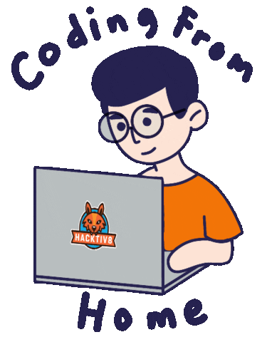
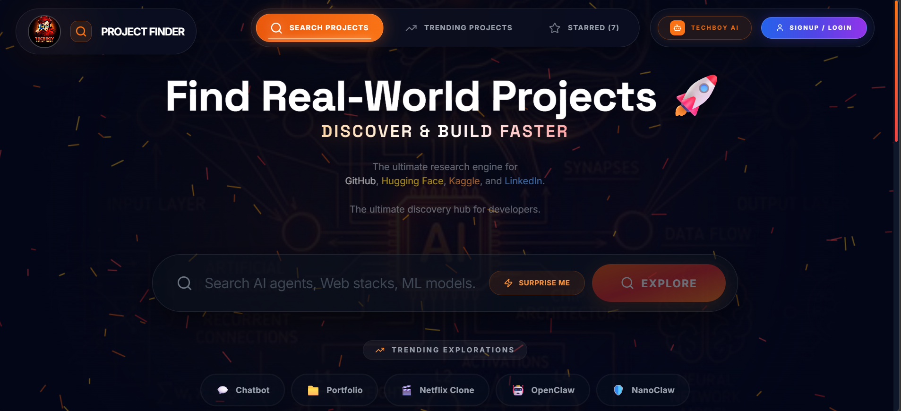
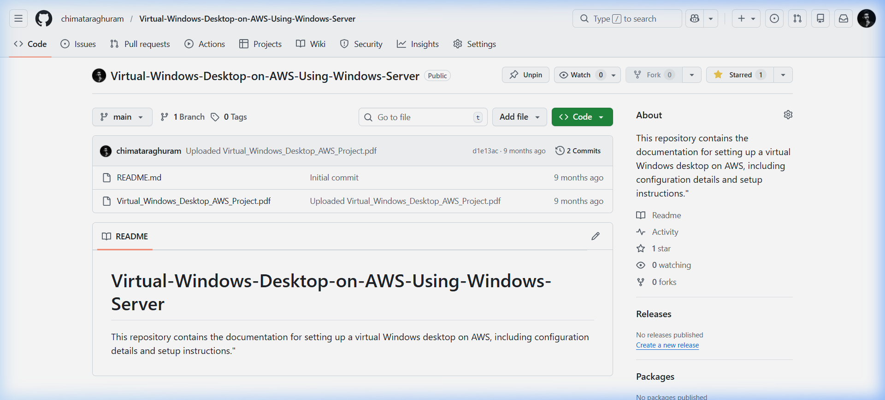
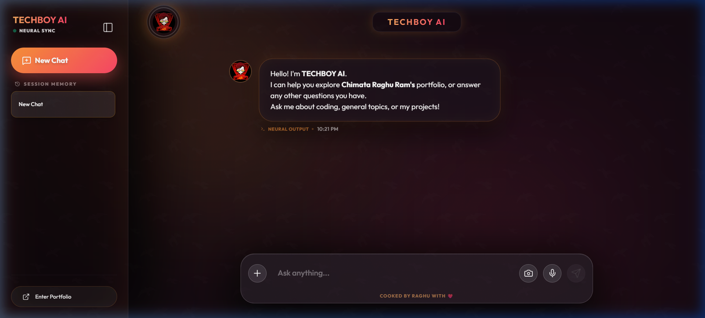
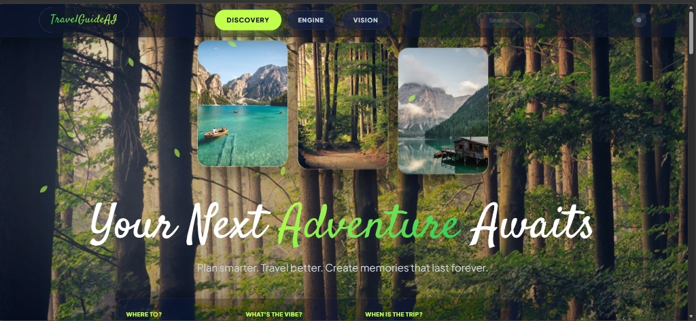
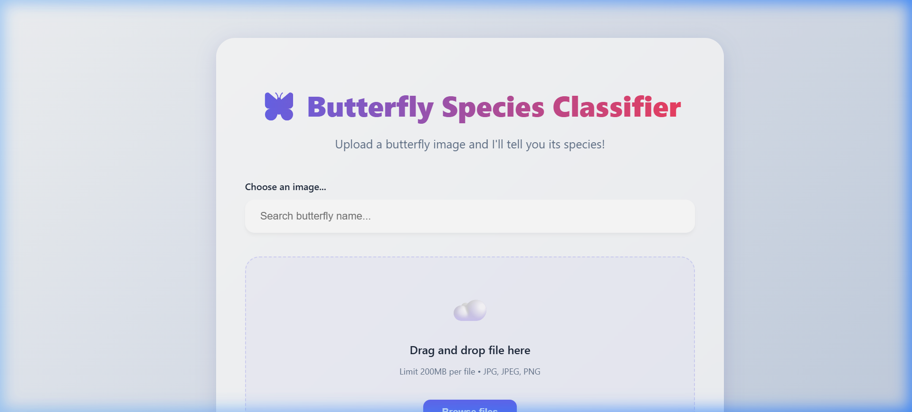

<!-- BANNER -->
<div align="center">
  
</div>

<!-- DYNAMIC TYPING SUBTITLE -->
<p align="center">
  
</p>

<!-- SNAKE CONTRIBUTION GRAPH -->
<div align="center">
  <picture>
    <source media="(prefers-color-scheme: dark)" srcset="https://raw.githubusercontent.com/chimataraghuram/chimataraghuram/output/github-contribution-grid-snake-dark.svg">
    <source media="(prefers-color-scheme: light)" srcset="https://raw.githubusercontent.com/chimataraghuram/chimataraghuram/output/github-contribution-grid-snake.svg">
    
  </picture>
</div>

<!-- BADGES -->
<p align="center">
  
  
  
  <!-- START_SECTION:deployments -->
  
  <!-- END_SECTION:deployments -->
  
</p>

<!-- OPEN TO WORK -->
<p align="center">
  
</p>


<!-- ACHIEVEMENTS -->
<div align="center">
  <br/>
  <a href="https://github.com/chimataraghuram?tab=achievements">
    
    
    
  </a>
  <br/>
  <strong>Official GitHub Achievements</strong>
</div>


## ⚡ About Me

<table>
  <tr>
    <td width="30%">
      
    </td>
    <td width="70%">
      <h2>Hello! I'm <b>Chimata Raghuram</b> 👋</h2>
      <p style="font-size: 1.15em; line-height: 1.6;">
        A B.Tech student with a diploma background in AI & ML, focused on developing Python full stack with AI powered and automated application
      </p>
      <ul style="font-size: 1.1em; line-height: 1.8;">
        <li>🚀 Python Full-Stack Developer | Actively Learning & Tech Enthusiast</li>
        <li>🌍 Based in <b>Vijayawada, Andhra Pradesh, India</b></li>
        <li>🔭 Currently building: <a href="https://github.com/chimataraghuram/PORTFOLIO">PORTFOLIO</a> · <a href="https://github.com/chimataraghuram/PROJECT-FINDER">PROJECT-FINDER</a> · <a href="https://github.com/chimataraghuram/TECHBOY-AI">TECHBOY-AI</a></li>
        <li>📫 Reach me: <a href="https://www.linkedin.com/in/chimataraghuram/">LinkedIn</a> · <a href="https://linktr.ee/chimataraghuram">Linktree</a> · <a href="mailto:chimataraghuram02a@gmail.com">Email</a></li>
      </ul>
    </td>
  </tr>
</table>

<br/>

### 📊 GitHub Analytics

<div align="center">
  
  
</div>

<br/>


<br/>

<div align="center">
  
</div>

## 💼 Work Experience

<table>
<tr>
<td width="50%" valign="top">

### 🐍 [Python Full Stack Intern](https://www.linkedin.com/in/chimataraghuram/)
**Nipuna Technology** | *11/2023 – 05/2024*
- Developed a web application by implementing **frontend interfaces** and backend logic using Python-based technologies.
- Gained hands-on experience in **API integration**, application structure, and full-stack development fundamentals.
<br/>📍 *Vijayawada, Andhra Pradesh*

</td>
<td width="50%" valign="top">

### ☁️ [Cloud Computing Intern](https://www.linkedin.com/in/chimataraghuram/)
**APSSDC** | *05/2025 – 07/2025*
- Deployed web applications on **cloud platforms** and configured hosting environments.
- Gained hands-on experience in cloud fundamentals including **deployment workflows**, scalability basics, and resource management.
<br/>📍 *Remote*

</td>
</tr>
<tr>
<td colspan="2" valign="top">

### 🤖 [Generative AI Intern](https://www.linkedin.com/in/chimataraghuram/)
**SmartBridge**
- Worked with **Generative AI models** and explored **Large Language Model (LLM)** applications and workflows.
- Built and tested **AI-driven workflows**, gaining hands-on experience in prompt engineering and automation concepts.

</td>
</tr>
</table>


<br/>

<div align="center">
  
</div>

## 🚀 TOP PROJECTS 📌

### 🌐 [PORTFOLIO](https://github.com/chimataraghuram/PORTFOLIO)
[](https://chimataraghuram.vercel.app/)
**Official Developer Portfolio with Hidden Mini-Game**
`TypeScript` `React 18` `Vite` `Tailwind CSS` `Canvas API`
- Official portfolio featuring a custom **Space Invaders-style minigame** and AI integrations.
- Sleek modern **glassmorphism UI** with 60FPS parallax & particle effects.
- Synthetic retro-game audio via **Web Audio API** and automated screenshots with Puppeteer.

🔗 [Live Demo](https://chimataraghuram.vercel.app/)


<hr>

### 🔎 [PROJECT-FINDER](https://github.com/chimataraghuram/PROJECT-FINDER)
[](https://github.com/chimataraghuram/PROJECT-FINDER/)
**The Ultimate Research & Discovery Engine 🚀**
`TypeScript` `React 19` `Node.js` `MongoDB` `Google Gemini AI` `Framer Motion`
- High-density research engine to discover open-source projects, AI models, and technical datasets.
- Unified discovery across **GitHub, Hugging Face, Kaggle, and LinkedIn** with platform-native profiles.
- Integrated with **TECHBOY AI** for architectural reviews and pro-grade technical analysis.
- Features Comparison Studio for side-by-side repository evaluation and secure cloud sync.

🔗 [Live Demo](https://chimataraghuram.github.io/PROJECT-FINDER/)


<hr>

### 🛒 [TECHBOY-STORE](https://github.com/chimataraghuram/TECHBOY-STORE)
[](https://github.com/chimataraghuram/TECHBOY-STORE)
**Modern E-Commerce Application**
`React` `Vite` `JavaScript` `CSS3`
- **Modern e-commerce web application** with clean, responsive UI.
- Product browsing, cart management, and a smooth shopping experience.

🔗 [GitHub Repo](https://github.com/chimataraghuram/TECHBOY-STORE)

<hr>

### ☁️ [Virtual Windows Desktop](https://github.com/chimataraghuram/Virtual-Windows-Desktop-on-AWS-Using-Windows-Server)
[](https://github.com/chimataraghuram/Virtual-Windows-Desktop-on-AWS-Using-Windows-Server)
**AWS Cloud Infrastructure & Remote Desktop**
`AWS EC2` `Windows Server` `RDP` `Security Groups`
- Set up a **fully functional Virtual Windows Desktop** on AWS using Windows Server.
- Configured secure remote access and performance optimization for cloud computing.
- Part of a broader AWS deployment suite including [Ubuntu Server setups](https://github.com/chimataraghuram/ProtoType-Website-Using-ubuntu-Server-On-AWS).

🔗 [View Project](https://github.com/chimataraghuram/Virtual-Windows-Desktop-on-AWS-Using-Windows-Server)


<br/>

<div align="center">
  
</div>

## 📂 Other Projects

### 🤖 [TECHBOY-AI](https://github.com/chimataraghuram/TECHBOY-AI)
[](https://chimataraghuram.github.io/TECHBOY-AI/)
**Premium AI Portfolio Assistant**
`TypeScript` `React` `Google Gemini 2.0` `Glassmorphism`
- Built a **premium AI-powered portfolio assistant** with custom Sunset Glassmorphism design.
- Features **intelligent conversational AI** using Google Gemini 2.0 Flash API with real-time streaming.
- Layered backdrop blurs, fluid jelly interactions, and dynamic radial ambient lighting.

🔗 [Live Demo](https://chimataraghuram.github.io/TECHBOY-AI/)

<hr>

### ✈️ [TravelGuideAI](https://github.com/chimataraghuram/Explore-With-Ai-Custom-Itineraries-For-Your-Next-Journey)
[](https://github.com/chimataraghuram/Explore-With-Ai-Custom-Itineraries-For-Your-Next-Journey)
**AI-Powered Neural Travel Planner**
`Python` `Streamlit` `FastAPI` `Google Gemini 1.5`
- AI-driven travel intelligence platform — a **"Neural Travel Architect"**.
- Hyper-personalization, **climate-aware logic**, and geographical route optimization.
- Adaptive Packing Assistant and Google Maps integration for hidden gems.

<hr>

### 🏠 [House Prediction](https://github.com/chimataraghuram/House-Prediction)
[](https://chimataraghuram.github.io/House-Prediction/)
**AI-Powered Real Estate Valuation**
`React 18` `FastAPI` `Scikit-learn` `Framer Motion`
- **Random Forest ML model** for high-accuracy house price predictions.
- Geospatial analysis with latitude/longitude for **location-based valuation**.
- Premium **liquid glassmorphism UI** with multi-city presets for Indian cities.

🔗 [Live Demo](https://chimataraghuram.github.io/House-Prediction/)

<hr>

### 🦋 [Enchanted Wings](https://github.com/chimataraghuram/Enchanted-Wings-Marvels-of-butterfly-species)
[](https://chimataraghuram.github.io/Enchanted-Wings-Marvels-of-butterfly-species/)
**AI Butterfly Species Classifier**
`React` `Vite` `FastAPI` `TensorFlow` `Keras`
- **Deep Learning model** for butterfly species identification with modern React UI.
- Real-time species search with images fetched dynamically from **Wikipedia**.
- Drag-and-drop uploading and **responsive design** across all devices.

🔗 [Live Demo](https://chimataraghuram.github.io/Enchanted-Wings-Marvels-of-butterfly-species/)

<hr>

### 🛡️ [Network IDS](https://github.com/chimataraghuram/AI-Based-Network-Intrusion-Detection-System)
**AI Cybersecurity — Intrusion Detection**
`Python` `Scikit-learn` `Streamlit` `Grok API`
- Detects **DDoS attacks** using Random Forest ML and Generative AI (Grok).
- Combines **traditional ML with LLM explanations** for security operations.
- Train, simulate, and analyze network packets in real-time.

<hr>

### 🛡️ [Phishing Detector](https://github.com/chimataraghuram/AI_Powered_Phishing_Email_Detector)
**AI Cybersecurity — Email Protection**
`Python` `Machine Learning` `NLP`
- Detects phishing emails using **AI/ML classification** with NLP-based text analysis.
- URL inspection, header analysis, and **real-time classification**.
- Combats email-based cyber threats with high accuracy.


<br/>

<div align="center">
  
</div>

## 🛠 Tech Stack

<div align="center">

**Languages**
<br/>


**Frontend & UI/UX**
<br/>


**Backend & AI/ML**
<br/>

<br/>
<code>LangChain</code> <code>HuggingFace</code> <code>Google Gemini</code> <code>Keras</code> <code>Scikit-learn</code>

**Cloud & DevOps**
<br/>


**Databases**
<br/>


</div>

---

## 🌱 Currently Learning

<div align="center">

### 🎯 Main Focus: Agentic Automation & AI Agents
| 🔧 Technology | 🚀 Goal |
| :--- | :--- |
| 🔄 **n8n** | Hyper-automation & Workflow Orchestration |
| 🤖 **OpenClaw** | Monolithic AI Agents & Local System Integration |
| 🔬 **NanoClaw** | Secure, Containerized Lightweight AI Agents |


</div>

---

## 📊 WakaTime Stats

<div align="center">
  <!-- WakaTime stats image removed because the external service is currently down. Dynamic text stats will appear below once the secret is added. -->
</div>

<br/>

<!--START_SECTION:waka-->

```txt
From: 05 April 2026 - To: 12 April 2026

No activity tracked
```

<!--END_SECTION:waka-->


<br/>

<div align="center">
  
</div>

## 🕒 Recent Activity

<!--START_SECTION:activity-->
1. 🔒 Closed issue [#1](https://github.com/chimataraghuram/sfgS-gSLRG-LI/issues/1) in [chimataraghuram/sfgS-gSLRG-LI](https://github.com/chimataraghuram/sfgS-gSLRG-LI)
2. ❗ Opened issue [#1](https://github.com/chimataraghuram/sfgS-gSLRG-LI/issues/1) in [chimataraghuram/sfgS-gSLRG-LI](https://github.com/chimataraghuram/sfgS-gSLRG-LI)
<!--END_SECTION:activity-->

<br/>

<div align="center">
  
</div>

## 🎨 Contribution Graph

<div align="center">
  
</div>

<br/>

<div align="center">
  
</div>


## 📬 Let's Connect

<div align="center">

| 💼 **LinkedIn** | 🐙 **GitHub** | 🌐 **Portfolio** |
| :---: | :---: | :---: |
| [](https://www.linkedin.com/in/chimataraghuram/) | [](https://github.com/chimataraghuram) | [](https://chimataraghuram.vercel.app/) |
| 📧 **Email** | 🔗 **Linktree** | ☕ **Buy Me a Coffee** |
| [](mailto:chimataraghuram02a@gmail.com) | [](https://linktr.ee/chimataraghuram) | [](https://buymeacoffee.com/chimataraghuram) |

<br/>

*Click the buttons above to reach out! I'm always open to discussing new AI projects and collaborations.*

</div>


<br />

<div align="center">
  <strong>Let's build something amazing together! 🚀</strong>
</div>

<!-- FOOTER -->
<div align="center">
  
</div>
